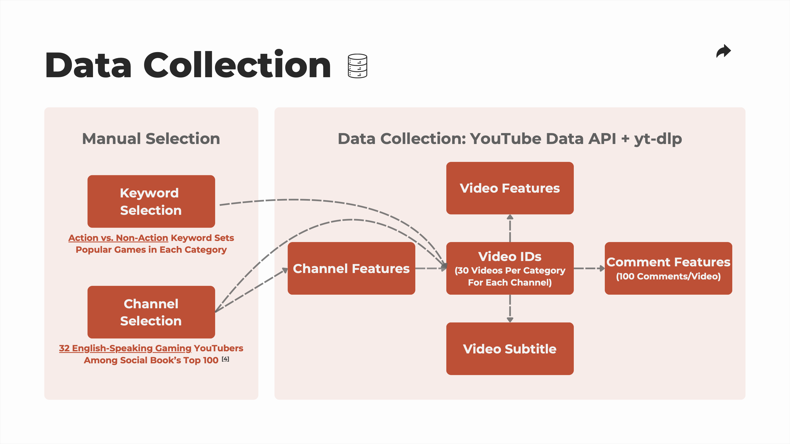
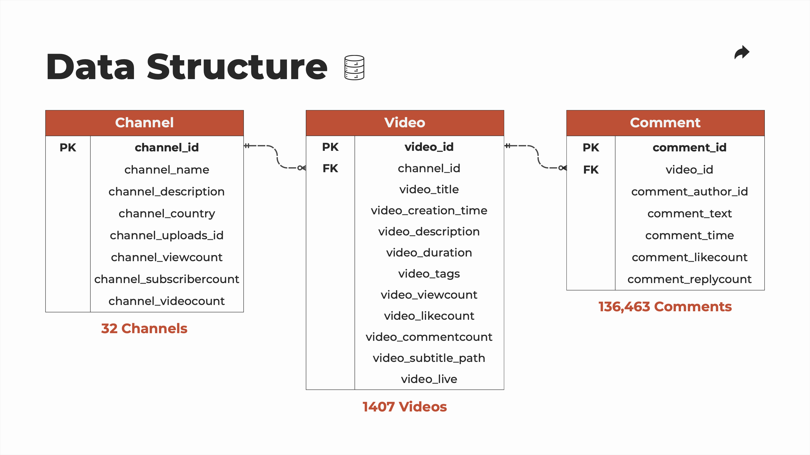
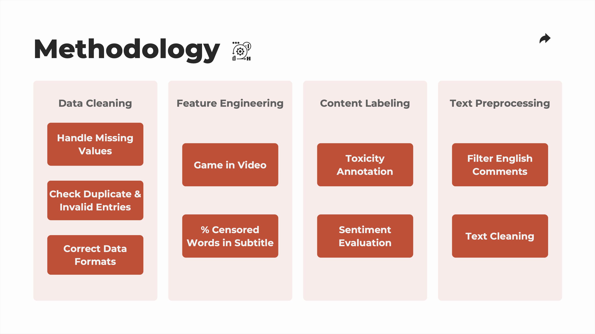
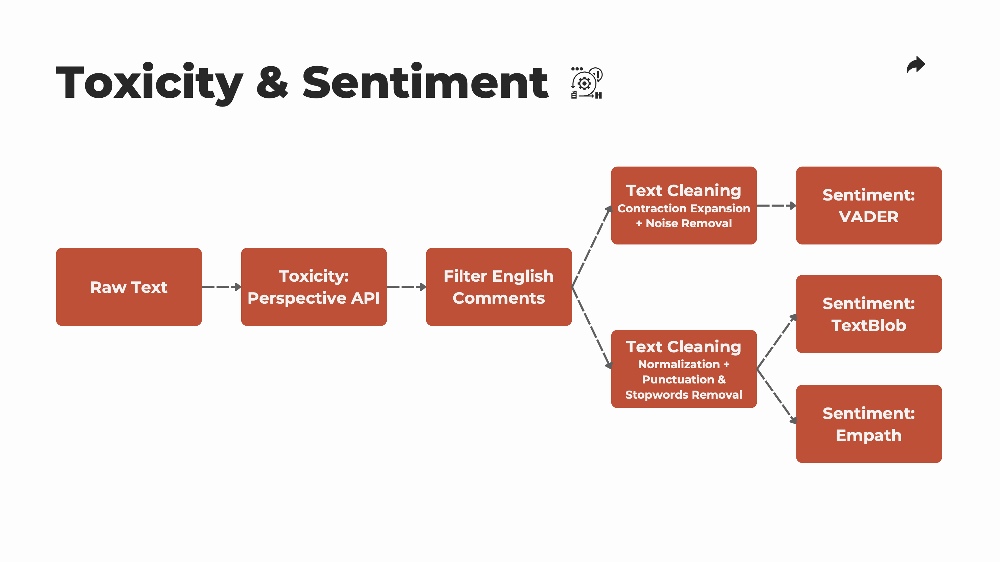

# YouTube Gaming Comment Toxicity: A Comparative Analysis of Action and Non-Action Games Video Comments

This project explores the prevalence of toxicity in YouTube gaming comment sections, focusing on the differences between action and non-action game videos. Utilizing Google Perspective API and NLP sentiment analysis, we analyze over 130,000 comments to identify patterns and correlations between video content and comment toxicity. Our findings highlight that action game videos tend to elicit more toxic comments, and that toxic video transcripts are more likely to generate toxic responses.  This research aims to guide video creators and the platform in fostering a more positive online gaming environment.  

## Research Questions

This study aims to address two key research questions within the YouTube gaming community:

1. **Does the genre of the games (action vs. non-action) influence the level of toxicity in the comment section?  If so, to what extent?**
2. **Does the content of the videos influence the level of toxicity in the comment section?  If so, to what extent?**

Through this research, we hope to generate valuable insights to better inform content moderation within online gaming communities.  

## Technical Overview

The project involves a comprehensive data pipeline for collecting, preprocessing, and analyzing YouTube comments. We utilized the YouTube Data API and `yt-dlp` to compile a dataset of 136,463 comments from 1,407 videos across 32 gaming channels. Toxicity scores were generated using the Google Perspective API, which was optimized for large-scale data processing by implementing a throttling management strategy with key rotation and exponential backoff. NLP preprocessing techniques, including text normalization, contraction expansion, and stopword removal, were applied to refine the data for sentiment analysis. Sentiment scores were computed using VADER, TextBlob, and Empath, providing a multifaceted view of the emotional dynamics within the comments. The final dataset consists of 124,704 comments and 1,307 videos, characterized by 448 features, enabling in-depth analysis and visualization of toxicity trends.

## Analysis and Findings

- **Influence of Game Genre on Toxicity**
    - We hypothesized that action game videos attract comments with greater toxicity.  Results from the one-tailed Mann-Whitney U test confirmed that **comments on action game videos are consistently more toxic** than comments on non-action game videos across all 6 metrics.  
    - Analysis revealed a **higher proportion of action games among the 100 videos with most toxic comment sections** compared to those with least toxic comment sections.  

- **Influence of Video Content on Toxicity**
    - We observed a **positive correlation between video and comment toxicity**.  Videos with more toxic or negative content, regardless of the game genre, tended to elicit more toxic comments. 
    - We investigated the video transcripts for 100 most and least toxic comment sections.  **Videos with highest comment toxicity frequently involve themes like "weapon", "violence", and "war"**, whereas those with least toxic comments predominantly feature positive topics like "music", "dance", and "fun".  

## Limitations and Future Work

- **Limitations**: 
    - Our study was restricted to English-language comments from selected channels, which may not fully represent the global YouTube gaming community.  
    - The binary classification of games into action vs. non-action may oversimplify the spectrum of game genres, overlooking nuances that could affect toxicity levels.  
    - The study solely focused on text-based features from video transcripts and comments, omitting the potential impact of visual content on viewer's perceptions and reactions.  

- **Future Work**: 
    - To enhance the generalizability of findings, future research should broaden the scope to include videos across various languages, channels, and game genres.  
    - Upcoming research will employ techniques like topic modeling to identify recurring themes in toxic videos and comments.  